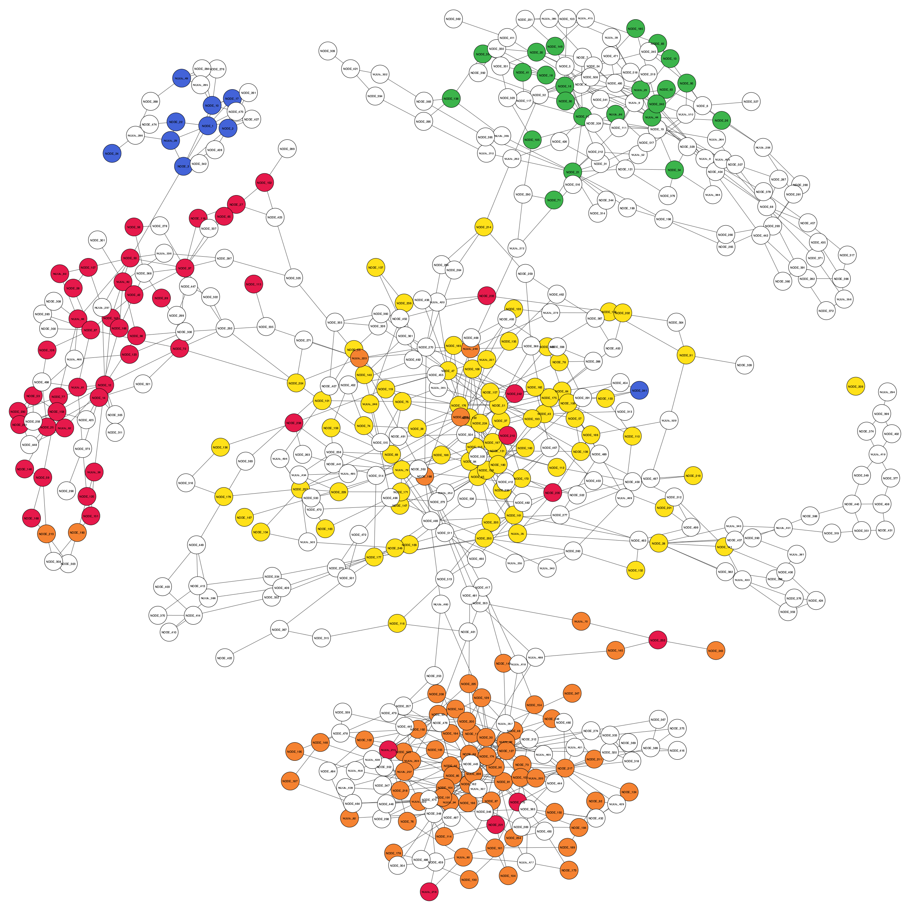
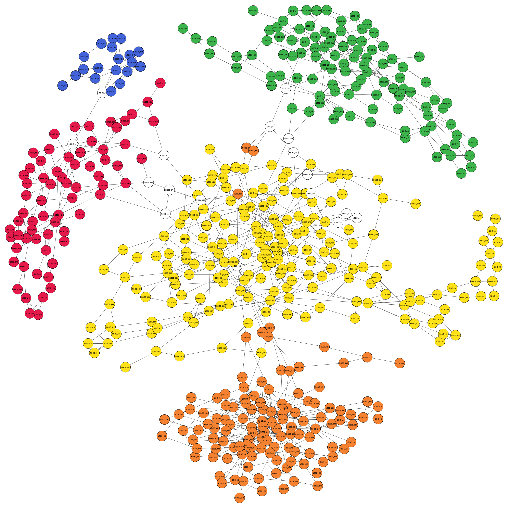

# Visualising binning results

You can use the `visualise` subcommand to visualise the binning results by denoting coloured contigs in the assembly graph according to their corresponding bins. You can visualise the initial binning result obtained from an existing binning tool and the final binning result obtained from GraphBin/GraphBin2 and compare.

Run `gbintk visualise --help` or `gbintk visualise -h` to list the help message for visualisation.

```shell
Usage: gbintk visualise [OPTIONS]

  Visualise binning and refinement results

Options:
  --assembler [spades|megahit|flye]
                                  name of the assembler used (SPAdes, MEGAHIT
                                  or Flye)  [required]
  --initial PATH                  path to the initial binning result
                                  [required]
  --final PATH                    path to the final binning result  [required]
  --graph PATH                    path to the assembly graph file  [required]
  --paths PATH                    path to the contigs.paths (metaSPAdes) or
                                  assembly.info (metaFlye) file
  --output PATH                   path to the output folder  [required]
  --prefix TEXT                   prefix for the output file
  --dpi INTEGER                   dpi value  [default: 300]
  --width INTEGER                 width of the image in pixels  [default:
                                  2000]
  --height INTEGER                height of the image in pixels  [default:
                                  2000]
  --vsize INTEGER                 size of the vertices  [default: 50]
  --lsize INTEGER                 size of the vertex labels  [default: 8]
  --margin INTEGER                margin of the figure  [default: 50]
  --type TEXT                     type of the image (jpg, png, eps, svg)
                                  [default: png]
  --delimiter [,|;|$'\t'|" "]     delimiter for input/output results. Supports
                                  a comma (,), a semicolon (;), a tab ($'\t'),
                                  a space (" ") and a pipe (|)  [default: ,]
  -h, --help                      Show this message and exit.
```

## Input Format

The *metaSPAdes* version takes in 4 files as inputs.

* Initial binning resilt (in `.csv` format)
* Final binning resilt (in `.csv` format)
* Assembly graph file (in `.gfa` format)
* Contigs file (in `.fasta` format)
* Contig paths file (in `.paths` format)
* Abundance file (in `.tsv` format) with a contig in a line and its coverage in each sample separated by tabs.

The *MEGAHIT* version takes in 3 files as inputs.

* Initial binning resilt (in `.csv` format)
* Final binning resilt (in `.csv` format)
* Assembly graph file (in `.gfa` format)
* Contigs file (in `.fasta` format)
* Abundance file (in `.tsv` format) with a contig in a line and its coverage in each sample separated by tabs.

The *Flye* version takes in 4 files as inputs.

* Initial binning resilt (in `.csv` format)
* Final binning resilt (in `.csv` format)
* Assembly graph file (`assembly_graph.gfa`)
* Contigs file (`assembly.fasta`)
* Contig paths file (`assembly_info.txt`)
* Abundance file (in `.tsv` format) with a contig in a line and its coverage in each sample separated by tabs.

## Example Usage

```shell
# SPAdes assembly
gbintk visualise --assembler spades --initial /path/to/initial_binning_res.csv --final /path/to/final_binning_res.csv --graph /path/to/graph_file.gfa --contigs /path/to/contigs.fasta --paths /path/to/paths_file.paths --output /path/to/output_folder

# MEGAHIT assembly
gbintk visualise --assembler megahit --initial /path/to/initial_binning_res.csv --final /path/to/final_binning_res.csv --graph /path/to/graph_file.gfa --contigs /path/to/contigs.fasta --output /path/to/output_folder

# Flye assembly
gbintk visualise --assembler flye --initial /path/to/initial_binning_res.csv --final /path/to/final_binning_res.csv --graph /path/to/assembly_graph.gfa --contigs /path/to/assembly.fasta --paths /path/to/assembly_info.txt --output /path/to/output_folder
```

### Example visualisation

**Initial binning result**



**Final refined binning result**

